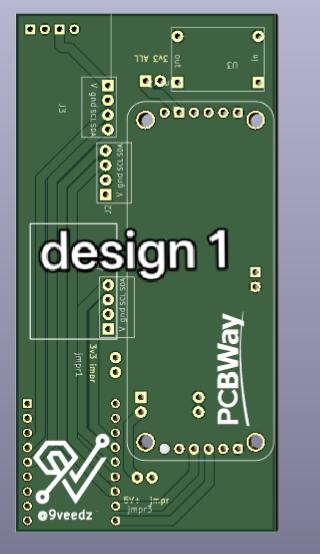
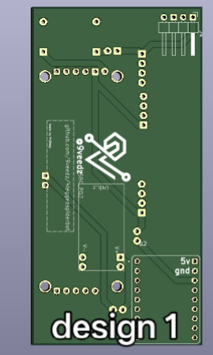
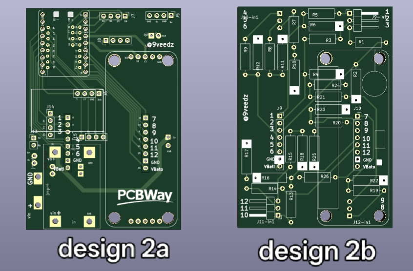
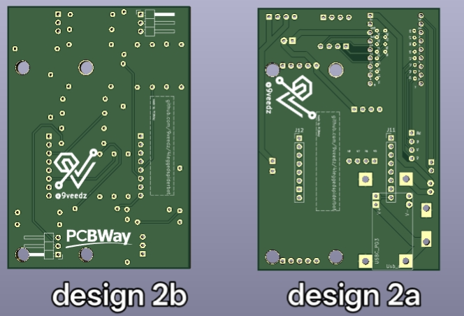

# 4-Legged Spiderbot — PCB

So this is the PCB folder for my spiderbot project a 4-legged walking robot I've been building in my spare time. It's been a fun (and sometimes painful) journey getting here.

>  **This project is sponsored by [PCBWay](https://www.pcbway.com)!** As a small hobby project with no real following or funding, being approached by PCBWay for sponsorship genuinely means a lot. I'm truly grateful for the support — it's what made getting real boards in my hands possible. More details in the [sponsor section](#sponsor--pcbway) below.

---

## PCB Designs

I went through 2 design revisions and ended up with 3 boards total. Here's how it went:

---

### Design 1 Single MCU Board

My first attempt everything on one board. Kept it simple.

| Component | Role |
|---|---|
| ESP32-S3 Supermini | Main MCU — hosts a WiFi HTML control page |
| PCA9685 | 16-channel PWM driver — drives all 12 servos |
| Buck step-down converter | Steps down input voltage to power the logic and servos |
| USB-C PD trigger board | Triggers USB-PD to get the right voltage into the buck |
| MPU-6050 | 6-axis IMU for orientation and tilt sensing |
| Output filter capacitors | Clean up the buck output |
| Header pins | Connections and module mounting |

Also broke out multiple I2C ports on separate pins — makes it easy to chain extra sensors or modules without fighting over the same lines.

The robot gets controlled through a webpage the ESP32-S3 hosts over WiFi — the phone does all the heavy lifting (IK, gait logic) and sends commands down to the PCA9685 which then drives the servos.

**Front**

**Back**

---

### Design 2 MCU Board + Voltage Divider Stackup (2 Boards)

After getting Design 1 working I wanted to add proper servo position feedback — so I split it into two stacked boards. Also upgraded the power side since the servos were pulling more current than I expected.

**Board 1 MCU Board**

Pretty much the same as Design 1 but with a beefier buck and dropped the USB-C PD board:

| Component | Role |
|---|---|
| ESP32-S3 Supermini | Main MCU WiFi control page |
| PCA9685 | 16-channel PWM driver all 12 servos |
| 5V 8A buck converter | Much beefier this time takes battery input directly, 5V @ 8A for the servos |
| MPU-6050 | 6-axis IMU |
| Header pins | Interface to the voltage divider board stacked on top |

> Dropped the USB-C PD trigger board in this revision — the new buck handles battery input directly so I don't need the PD negotiation anymore.

Also in this revision I mapped out all the GPIOs to header pins — so if I want to hook up extra peripherals, sensors, or expand the project later, the pins are already there and accessible without any rework.

**Board 2 Voltage Divider Board** (stacks on top of Board 1)

This little board stacks right on top and reads servo positions by tapping into each servo's internal pot:

| Component | Role |
|---|---|
| Resistor voltage dividers | One per servo scales the pot signal down to a safe ADC input range |
| Resistor voltage divider | Battery level monitoring |
| Header pins | Connects down to Board 1 and feeds signals into the ESP32-S3 ADC pins |

The idea is to tap into the servo's internal position potentiometer and use that as feedback for closed-loop position control. Pretty cool once it works!

**Front**

**Back**

---

## Sponsor — PCBWay

I'm really grateful to **[PCBWay](https://www.pcbway.com)** for sponsoring the PCBs for this project. As a hobby engineer doing this on my own time and budget, getting sponsored boards was a massive help and I honestly wasn't expecting the quality to be this good.

### What is PCBWay?

PCBWay is a PCB manufacturer and fab service out of Shenzhen. They do pretty much everything:

- PCB fabrication (single layer all the way up to 20+ layers, rigid, flex, rigid-flex)
- PCB assembly (SMT + through-hole, full turnkey)
- 3D printing (FDM, SLA, SLS, and even metal)
- CNC machining and sheet metal
- One-stop prototyping for small runs

Their online quote tool is instant and the turnaround is genuinely fast standard boards can ship in 24 hours.

---

### My Experience

The spiderbot boards aren't super complex but they're not trivial either 12 servo channels, multiple power rails, a stackup between two boards. I uploaded my Gerbers and got a quote almost immediately, no back and forth.

**Ordering was straightforward:**
1. Exported Gerbers and drill files from KiCad and compressed them into a single zip file
2. Uploaded to the PCBWay portal 
3. most of the parameters are selected by default from the gerber files but you can customize according to your requirements
4. Order confirmed and out the door within 24 hours

**When the boards arrived:**
- Well packed anti-static bags inside a solid mailer, no damage
- V-score lines on the panel were clean and snapped apart easily
- Soldermask was crisp, silkscreen was readable, no bridging on any pads

**Dimensions held up:**
- Outline matched my design within ±0.1mm
- Vias and traces exactly as in the Gerbers
- Stacking fit between the two boards was spot on

Honestly for a hobby project like this, PCBWay hit the sweet spot of quality, speed, and price. If you're building something similar definitely worth checking them out → [pcbway.com](https://www.pcbway.com)

---

## Repo

Full project: [github.com/9veedz/4leggedspiderbot](https://github.com/9veedz/4leggedspiderbot)

PCB files: [PCB folder](https://github.com/9veedz/4leggedspiderbot/tree/main/PCB)
